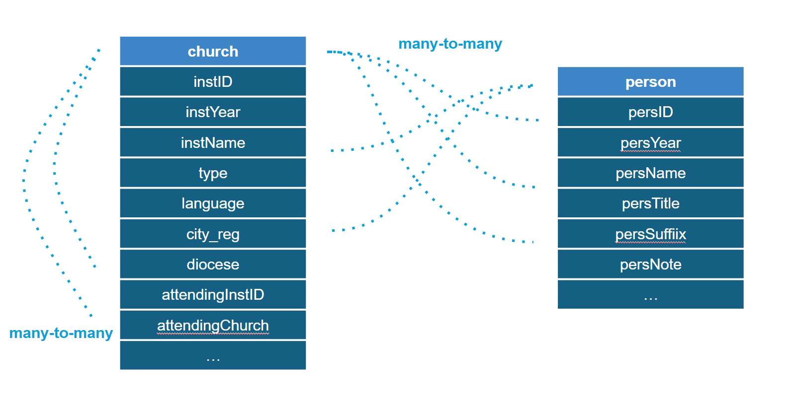
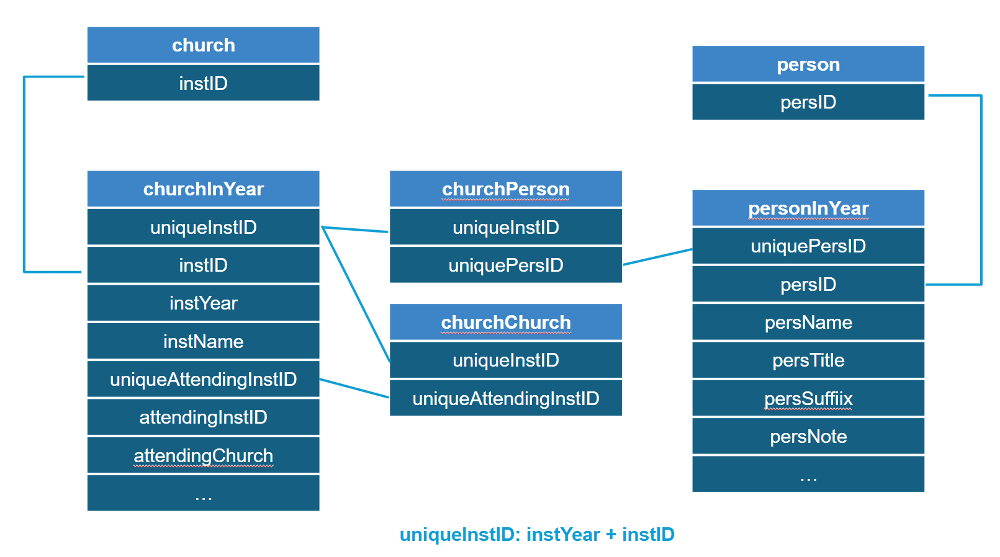

As introduced in the section “Context” (link), there are various types of data – catholic institutions and people – in the almanacs. What’s more, these data are interconnected with each other: in a specific year, for example, a church may be attending a few other smaller churches, while having multiple priests residing in it. In other words, as shown in the picture below, there are a lot of many-to-many relationships between catholic institutions (for the sake of simplicity, I named them “church”) and catholic institutions, as well as between catholic institutions and people.

    

Besides, it is noteworthy that the relationship between catholic institutions and people can change over time. In the following demonstrative chart, we can see that compared with year 1869, church001 no longer attends church002 in 1870, and person002 switches to church002 instead of staying in church001. Similar changes of how institutions and people are related to each other take place very frequently in the almanacs.

    

Therefore, in order not only to track and search for the evolvement of metadata but also the evolvement of the relationship between different categories of data, a database is needed to store the metadata as well as the relationship between metadata. This chart illustrates how I design the tables:

    

The table “church” records the unique, immutable institution ID (instID) for each catholic institution. The table “churchInYear” corresponds to all the potentially mutable information of a specific institution in a specific year – its name, language, type, diocese, place, etc. Similarly, the table “person” records the unique, immutable person ID (persID) for each person.
