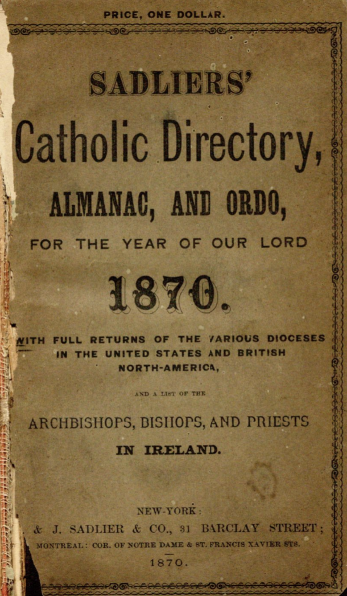
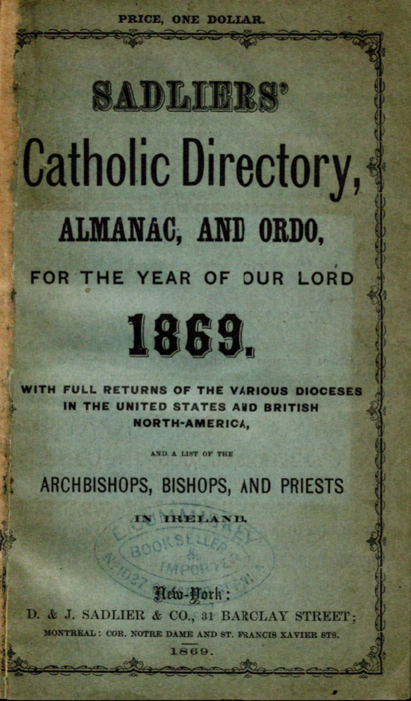
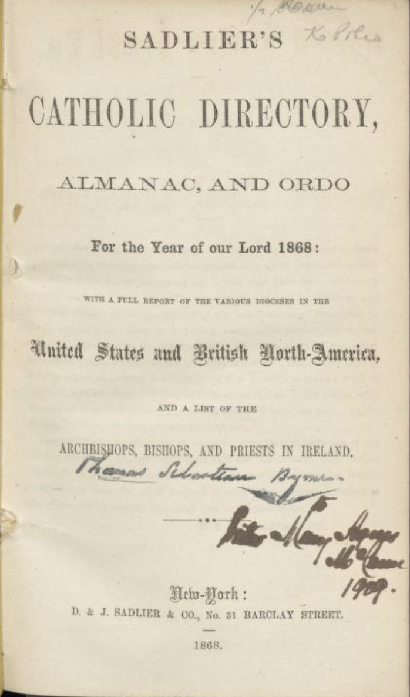

# Introduction
<figure markdown>
    
    
    
</figure>

## The project

Ideally, this DH capstone project serves as part of a larger, multi-year project that the Digital Scholarship Group has been working on: The Catholic Almanacs Project. The overall goal is to digitize American Catholic almanacs in the mid-and late-nineteenth century by collecting metadata from the almanacs, refining the metadata, and building a website that allows users to access the data. This capstone project mainly focuses on the last step – constructing a searchable database and a web interface in an accessible, user-friendly, and sustainable way while also visualizing the huge efforts of the data collection process.

## The research question

Apart from learning and applying the skills of relational database and web development, I am also trying to answer a few research questions about how to use technology in a humanities project so that it could be more humanized (both in terms of using the website and displaying the data) and sustainable.

Specifically, I am focusing on the use cases of different web architecture environments in database development. For the Almanacs project, I used two different web frameworks to build the database – the Django (python) framework and the Nodejs/Angular framework. The former framework only has a “flat” structure, which means that it only has the back end but does not have the front end. Despite its relatively plain structure, it is easier to learn and simpler in database construction. The latter framework, on the contrary, has both the back end and the front end, as well as an API. Its complicated structure makes it more flexible in data management and presentation and more reusable, though it is more time-consuming to learn and use.

Starting from the two different web architecture environments, I want to understand which one better manages and displays large amounts of data for a user, as well as what are the advantages of using an API over a flat website in terms of presenting and offering data. I would also like to explore which framework is better to use in UI design. By using, comparing, and reflecting on various web frameworks in this project, I hope that users can maximize the benefit of an accessible and sustainable database.

## About me

I am a first-year English MA student at Boston College, and I hold a Bachelor of Engineering degree in Automation from Tsinghua University. With a multidisciplinary background, I am passionate about exploring the intersection of humanities and technology. My research interests focus on how Digital Humanities methodologies, such as database development and textual analysis, can influence how people understand data and bring new insights into traditional literary studies.
